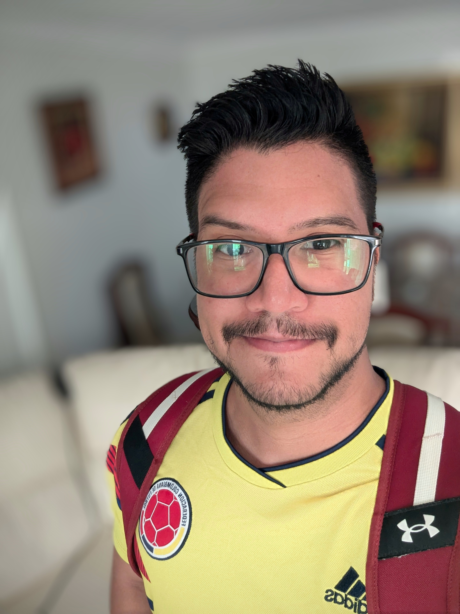

<!DOCTYPE html>
<html lang="en">
<head>
<meta charset="UTF-8">
<meta name="viewport" content="width=device-width, initial-scale=1.0">
<title>Oscar Castillo — Senior Multimedia Designer</title>
<link rel="preconnect" href="https://fonts.googleapis.com">
<link rel="preconnect" href="https://fonts.gstatic.com" crossorigin>
<link href="https://fonts.googleapis.com/css2?family=Plus+Jakarta+Sans:wght@400;500;600;700;800&display=swap" rel="stylesheet">

</head>
<body>

<!-- NAV -->
<nav id="mainNav">
  <a class="nav-logo" href="#hero">Oscar.</a>
  

    <ul class="nav-links">
      <li></li>
      <li></li>
      <li></li>
      <li></li>
    </ul>
    

      <button class="lang-btn active" id="btnEN">EN</button>
      <button class="lang-btn" id="btnES">ES</button>
    

  

</nav>

<!-- HERO -->

  

    

    <h1 class="hero-name">Oscar <em>Castillo.</em></h1>
    

    

      
      
    

  

  

    
    

      

      
10+ yrs

    

  

<!-- PROJECTS -->
<section id="projects">
  

  <h2 class="section-title" data-i18n="proj_title"></h2>
  

</section>

<!-- AI SECTION -->
<section id="ai-tools" style="max-width:1200px;margin:0 auto;padding:80px 48px 0;">
  

  <h2 class="section-title" data-i18n="ai_title"></h2>
  

  

</section>

<!-- SKILLS -->
<section id="skills">
  

  <h2 class="section-title" data-i18n="skills_title"></h2>
  

</section>

<!-- ABOUT -->
<section id="about">
  

  <h2 class="section-title" data-i18n="about_title"></h2>
  

    

      
      

        <a class="social-link" href="mailto:oscar.castle88@gmail.com">
          ✉ oscar.castle88@gmail.com
        </a>
        <a class="social-link" href="https://www.linkedin.com/in/oscarcastle88" target="_blank">
          in linkedin.com/in/oscarcastle88
        </a>
      

    

    

  

</section>

<!-- CONTACT -->

  

    <h2 class="contact-title" data-i18n="contact_title"></h2>
    

    

      <a class="contact-link email" href="mailto:oscar.castle88@gmail.com">
        ✉ oscar.castle88@gmail.com
      </a>
      <a class="contact-link linkedin" href="https://www.linkedin.com/in/oscarcastle88" target="_blank">
        in 
      </a>
    

  

<footer></footer>

<!-- MODAL -->

  

    

      

        
        

      

      

        

          

          <button class="modal-close" id="modalClose">✕</button>
        

        <h2 class="modal-title" id="modalTitle"></h2>
        

          
          
        

        

      

    

  

</body>
</html>
